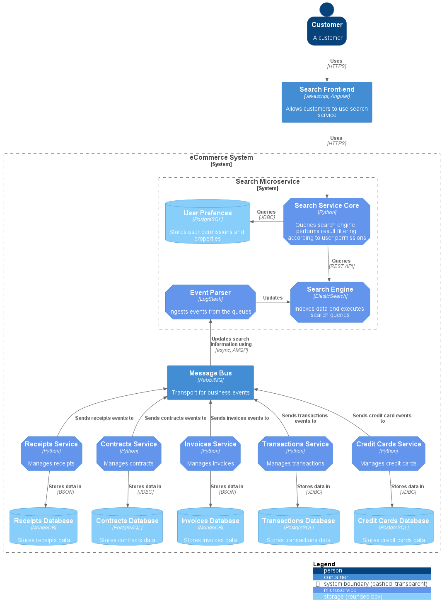
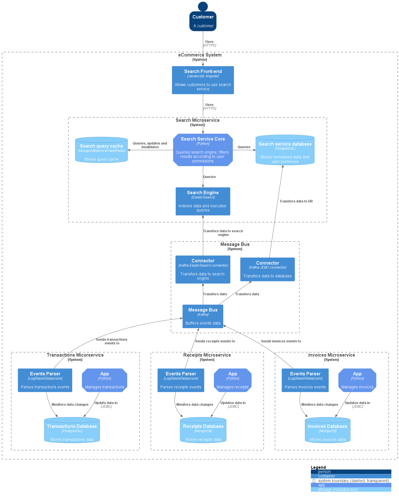
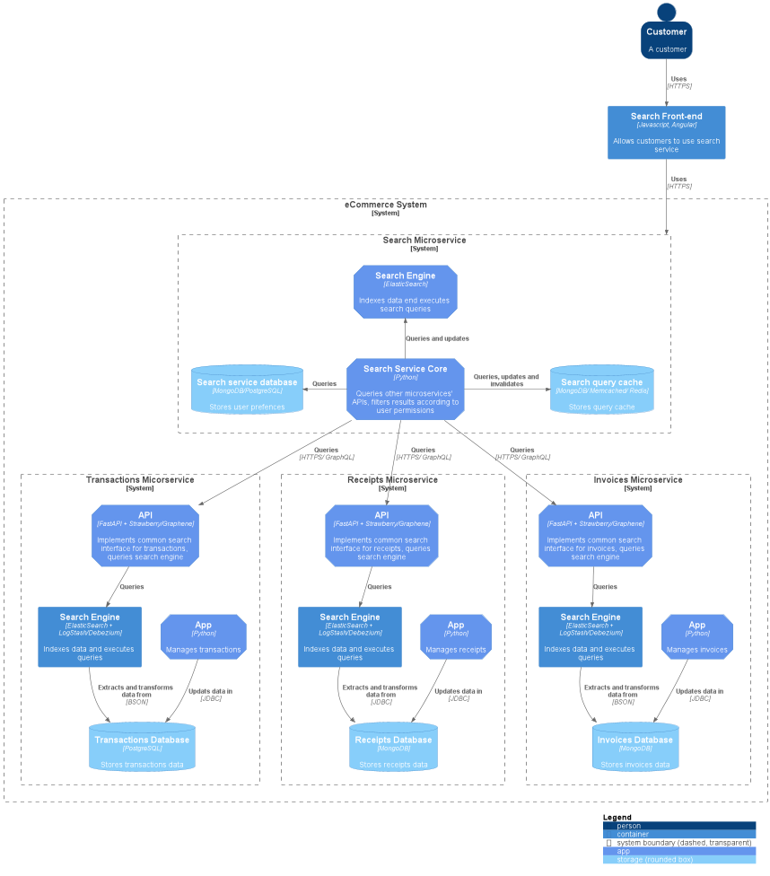
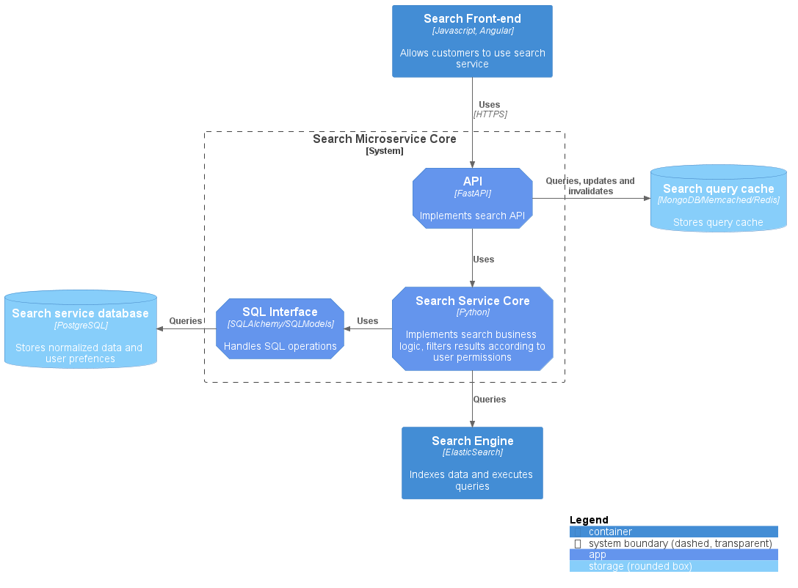

# Search service

## 1. Context

We have a set of microservices: invoices, transactions, receipts, contracts, and credit cards. Each service works in a 
separate container and talks to a separate database.

## 2. Task

Our users have to be able to search the data stored in all of these services.

You have to create an architecture of Search service that

- is handling all information from all these microservices
- the information in the search service has to be kept up to date (in case something is changing in other microservices, 
- the search data has to follow changes)

- Some users have access restriction policies. For example, some users are not allowed to see some invoices or contracts
- Hence, these **users should not see** documents with restricted access in search results

## 3. Discussion

There are several possible ways to implement search across microservices according to these requirements. All of them 
have their pros and cons.
Basically, the data can be either pushed from microservices to some sort of data collector, or pulled from microservices
externally. 

The first case is illustrated by the diagrams below

## 4. Inside-out (push) approach 

### 4.1. Already existing queue 

This architecture is built under assumption that the aforementioned microservices are already integrated with each 
other and/or with some sort of core app, and this integration is implemented by message queues (let's assume it is
RabbitMQ). In this case, search microservice includes event parser (e.g. LogStash) and database + search engine
(e.g. ElasticSearch). 

This can be implemented relatively effortless, given the events passed through the queue are already standardized to some 
degree, so little to none modifications are needed in microservices. Search engine core in this case only implements 
business logic related to search results filtering according to user settings (permissions, wallet balance, etc).

This architecture, however, breaks Single responsibility principle to some extent, because search service have to be 
aware of different implementations in different entities. Plus, if the exchange format of, say, invoice changes, the
event parser rules should be also modified accordingly.

### 4.2. No queue prior to search implementation

For the sake of the simplicity, only 3 microservices are shown. This architecture assumes that that other microservices 
either don't use messaging system for communication, or the messages produced by microservices don't contain sufficient 
information for search. 

Therefore, all the microservices will be modified in any case. Then we can add event parser of some kind to each 
container. I would use  either LogStash with appropriate integration, or Debezium. I would also use Kafka as a 
transport both to update ElasticSearch index and DB (uses ar archive and/or cold storage)

We still don't introduce many changes in existing code of microservices, but add complexity to the system by modifying
each container and adding message queue. This approach conforms to SOLID principles more than previous, because we
don't create some sort of God service, but rather encapsulate all the data-related logic (and possible data 
transformations) inside each microservice.

## 5. Outside-in (pull) approach

This architecture assumes that we have to modify all the containers and do not use any sort of messaging. We then can
define abstract API that will allow extraction of different entities' data, and partially implement it for each
microservice. Search service will periodically query these APIs (e.g using celery), put it to index and perform search 
using ElasticSearch.

This approach violates Interface segregation principle, as the microservice API will contain a lot of methods and fields
that belong to different entities. We also don't have instant updates to the search index - the data update rate depends
on celery (or other scheduler). However, this approach can be used if for some reason any sort of queue is prohibited.

## 6. Microservice core composition

The microservice core architecture is proposed as follows.

SQLAlchemy (or, preferably, [SQLModels](https://sqlmodel.tiangolo.com/), which is more pythonic and belong to the same
ecosystem as FastAPI) is used as an ORM. API requests are handled by FastAPI instance. All business logic related to
search (and search only) is encapsulated in core service. Data validation and parsing can be performed using Pydantic.
In case when we use queues, we don't need any scheduler, which simplifies design and implementation.

## Conclusion

My personal preference is variant shown in 4.2 as it conforms to philosophy of OOP and DDD, and is more SOLID-compliant
than others. We offload the logic related to data preparation to the entities responsible for it (single responsibility), 
and encapsulate only the logic related to search in a new microservice (encapsulation). We keep our search index up to 
date because the events are transferred there immediately. We have relatively low coupling as search service don't know
anything about internal data structures in other microservices.

As a side benefit, we can use replay functionality of Kafka for search customization (this might be useful if user's 
right to view certain transactions or invoices is related to the history, or if  we will decide to implement some sort 
of advisory functionality to the search)